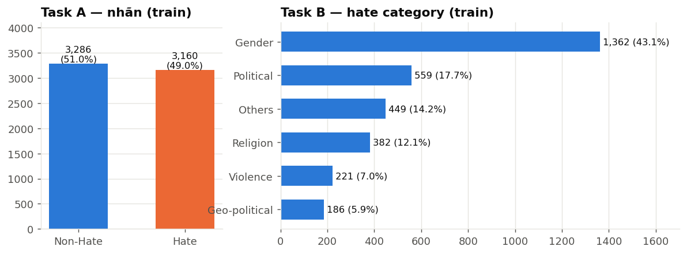
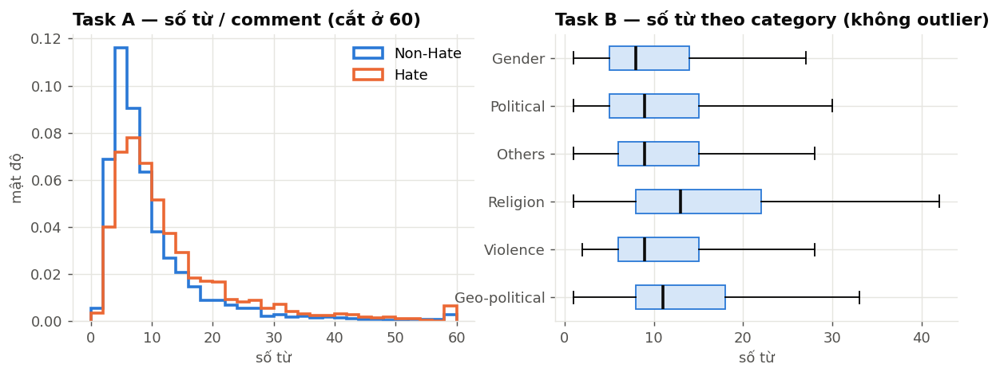
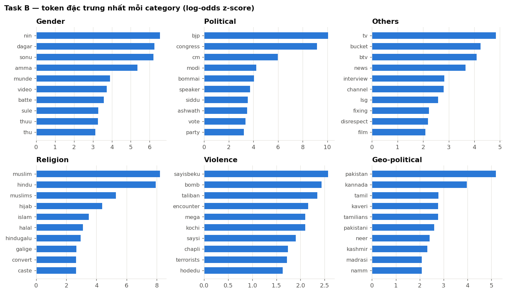
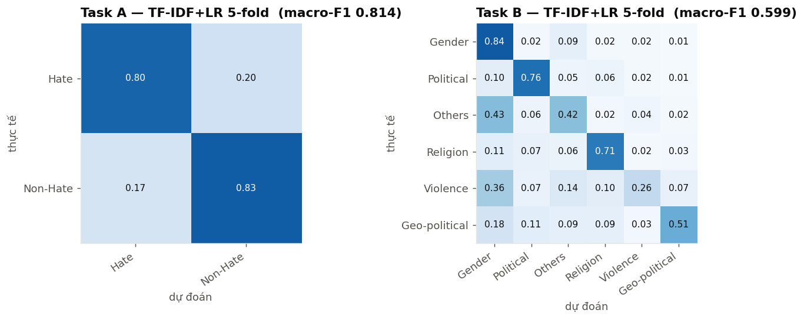

# HASTIKA @ ICON-2026 — Báo cáo EDA

Chạy lại toàn bộ: `python -m src.eda.eda` (từ thư mục gốc repo, ~1 phút).

```
src/eda/eda.py             # script sinh toàn bộ kết quả
docs/eda/
├── README.md              # báo cáo này
├── figures/               # 5 biểu đồ
└── stats/                 # bảng số liệu (csv/json), summary.json
```
Dữ liệu đã làm sạch dùng cho mô hình do `src/data/preprocessing.py` sinh ra ở `data/processed/`.

---

## 1. Tổng quan & chất lượng dữ liệu

| File | Dòng | Trùng (exact / chuẩn hoá) | Lỗi encoding | HTML | Emoji | Chữ Kannada | Từ (median / p95 / max) |
|---|---|---|---|---|---|---|---|
| binary_train | 6,446 | 37 / 57 | 923 | 473 | 934 | 46 | 8 / 31 / 139 |
| binary_val | 806 | 0 / 0 | 129 | 58 | 129 | 4 | 8 / 32 / 130 |
| multiclass_train | 3,159 | 13 / 15 | 189 | 249 | 186 | 5 | 9 / 35 / 130 |
| multiclass_val | 395 | 0 / 0 | 18 | 38 | 19 | 2 | 10 / 35 / 124 |

- Không có giá trị rỗng, không trùng `id`, không có comment rỗng sau khi làm sạch.
- **Lỗi encoding (mojibake):** khoảng 14% dòng lưu UTF-8 bị đọc sai thành Latin-1, ví dụ `à²à³à²¹à³à²²à²¿` thực ra là `ಕೊಹ್ಲಿ`, `ðª` là 💪. Hầu hết các dòng này là **dòng có emoji**. `src/data/preprocessing.py` sửa bằng `ftfy` + `html.unescape`, bỏ `<br>`, thay URL bằng token `URL`.
- **Mâu thuẫn nhãn trong các câu trùng:** Task A có 3 câu, Task B có 2 câu (xem `stats/02_duplicate_label_conflicts.csv`). Nên gộp các câu trùng lại hoặc bỏ đi, và chia fold theo nhóm câu trùng.
- **Val trùng với train:** 14 câu val Task A và 5 câu val Task B có nội dung giống hệt câu trong train.
- Gần như toàn bộ viết bằng **chữ Latin** (Kanglish); chữ Kannada gốc chỉ khoảng 0,7%.

## 2. Phân bố nhãn



- **Task A cân bằng** (49/51), nên không cần xử lý mất cân bằng.
- **Task B lệch 7,3 lần** (Gender 43% so với Geo-political 5,9%). Vì Macro-F1 chấm các lớp ngang nhau, cần dùng class weight hoặc focal loss, stratified K-fold, và tinh chỉnh ngưỡng theo từng lớp.

## 3. Độ dài



- Câu rất ngắn: 95% dưới 35 từ. Vì vậy **`max_len` 64–128 token** là đủ cho transformer (tokenizer subword của chữ Latin chuyển tự thường tạo khoảng 2–3 token/từ).
- Câu Hate dài hơn câu Non-Hate (median 9 so với 7 từ). Ở Task B, **Religion** (median 13) và **Geo-political** (median 11) dài nhất.

## 4. Đặc trưng bề mặt — cảnh báo về bias

| | Có emoji | Chữ Kannada |
|---|---|---|
| Hate | **5,4%** | 0,2% |
| Non-Hate | **23,2%** | 1,2% |

Việc có emoji là **tín hiệu Non-Hate rất mạnh**: tỉ lệ ở Non-Hate cao gấp khoảng 4 lần Hate. Emoji phổ biến ở Non-Hate là 🔥 🙏 ❤ 👌 🚩 🇮🇳; ở Hate là 😡 🤬 🐖 🤦 (`stats/05_top_emoji.json`). Đây có thể là tín hiệu thật, nhưng cũng có thể là **dấu vết của cách thu thập dữ liệu**. Nên giữ emoji (hoặc chuyển thành chữ bằng `emoji.demojize`), đồng thời thử ablation bỏ emoji để kiểm tra mô hình có học lối tắt hay không.

## 5. Từ vựng & biến thể chính tả

- 21.277 từ khác nhau; **70% chỉ xuất hiện đúng 1 lần** (hapax). **21% token trong val không có trong train (OOV)**. Mô hình dựa trên từ nguyên vẹn sẽ bị hạn chế, nên ưu tiên **char n-gram / subword**.
- Một từ được viết theo rất nhiều cách (`stats/06_spelling_variants.csv`), ví dụ:
  - *ninu / neenu / nenu / ninuu*
  - *nivu / neevu / neev / nevu*
  - *adre / aadre / idre / idare / edare*
  - *antha / intha / entha / yentha*
- **Gợi ý chuẩn hoá nhẹ:** gộp ký tự lặp (`thuuu` thành `thuu`), đưa về chữ thường. Có thể thử chuyển về chữ Kannada (IndicXlit) làm một góc nhìn thứ hai cho mô hình.

## 6. Token đặc trưng (log-odds với Dirichlet prior)

**Task A:**
- Hate: `thu, sule, nin, dagar, nan, maklu, magane, munde, nayi, maga` (chửi tục / xúc phạm)
- Non-Hate: `jai, sir, bro, super, movie, guru, anna, kohli, match`



- **Political, Religion, Geo-political** có từ khoá rất rõ (bjp/congress, muslim/hindu/hijab, pakistan/tamil/kaveri), nên dễ phân loại.
- **Gender** gắn nhiều với từ chửi nhắm vào phụ nữ và **tên người cụ thể** (`sonu`, `meghana`). Mô hình có nguy cơ học thuộc tên thay vì học ngữ nghĩa.
- **Others** chủ yếu là chỉ trích truyền thông (tv, btv, news, channel) và **Violence** (sayisbeku = "phải giết", bomb, encounter). Hai lớp này ít từ khoá chung, nên khó nhất.
- Token chủ đề (`interview`, `kohli`, `movie`) cũng cho thấy nhãn tương quan với **video nguồn** (topic bias).

## 7. Baseline tham chiếu (TF-IDF char 2–5 + word 1–2 → Logistic Regression, 5-fold CV)



| Task | Macro-F1 | Accuracy | F1 theo lớp |
|---|---|---|---|
| A | **0,814** | 0,814 | Hate 0,808 · Non-Hate 0,819 |
| B | **0,599** | 0,689 | Gender 0,783 · Political 0,766 · Religion 0,716 · Geo-political 0,556 · **Others 0,440** · **Violence 0,331** |

- Baseline tuyến tính đơn giản đã **ngang BERT trong bài báo gốc** (acc 0,805 / 0,682). Đây là mốc tối thiểu cần vượt.
- Task B: **Others** (43% bị đoán nhầm thành Gender) và **Violence** (36% nhầm thành Gender) là điểm nghẽn. Muốn cải thiện Macro-F1 thì phải tập trung vào hai lớp này.

## 8. Cấu trúc `id` giữa các file (lưu ý rò rỉ nhãn)

- `id` đánh chung cho toàn bộ dữ liệu (0–8057). 4 file hiện có chứa 7.616 id; 442 id còn lại chưa xuất hiện, nhiều khả năng thuộc tập test.
- File Task B **chỉ chứa câu Hate** và có nội dung giống hệt file Task A với cùng `id`.
  - 324 id của `binary_validation_inputs` nằm trong `multiclass_train`, tức là đã biết chắc là Hate.
  - **364 id của Task B không có trong train/val Task A**, rất có thể thuộc test Task A.
- **Khuyến nghị:** không dùng thông tin này để dự đoán (vi phạm tinh thần thể lệ về nhãn test) và báo cho ban tổ chức. Khi đánh giá nội bộ, **không** đưa đặc trưng liên quan đến `id` vào mô hình.
- Ngoài ra có 326 câu Hate trong train Task A không có nhãn category. Có thể dùng chúng cho pseudo-label hoặc pretrain MLM ở Task B.

## 9. Việc cần làm tiếp theo

1. Dùng `data/processed/` và chia **StratifiedGroupKFold** (nhóm theo câu đã chuẩn hoá) với seed cố định. ✅ đã làm
2. Fine-tune MuRIL / XLM-R-large / IndicBERTv2 với `max_len=96`. Task B dùng weighted CE hoặc focal loss.
3. Ensemble transformer với baseline TF-IDF ở mục 7, rồi tinh chỉnh ngưỡng để tối ưu Macro-F1.
4. Task B: tăng dữ liệu cho Violence / Geo-political / Others (LLM paraphrase, back-transliteration).
5. Ablation: bỏ emoji và che tên riêng để đo mức phụ thuộc vào lối tắt, dùng làm nội dung phân tích cho system paper.
